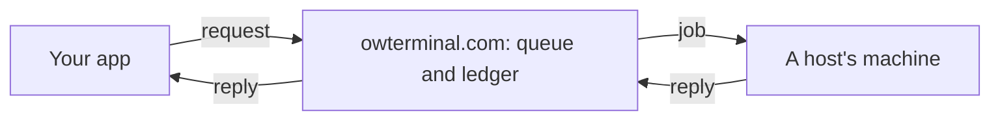

# How it works

OpenWeights Terminal has two parts. The catalog measures open models on real hardware: a model, a quant, a runtime and a chip, ranked by tokens per second. The pool, at [owterminal.com/inference](https://owterminal.com/inference), runs API calls on machines that independent hosts provide. Callers and hosts share one ledger.



Our server never decides what the model says. It holds the job, erases the prompt when a host picks it up, and keeps the ledger.

## Calling a model

1. **Get a key.** On [owterminal.com/inference](https://owterminal.com/inference), choose **I want to call**. The page makes an API key and keeps it in that browser. No account is needed; signing in with X only syncs and recovers keys.
2. **Add credit.** Quote a credit pack and pay with shielded ZEC (an address and a memo) or USDC on Base (an exact amount: a fraction of a cent in it identifies your quote, since a USDC transfer has no memo). Sending the payment does not move your balance; it moves when the desk sees the payment.
3. **Pick a model that is awake.** `GET /api/v1/models` lists live models and the cheapest price for each.
4. **Call it.** The API speaks the OpenAI chat-completions shape, so any HTTP client works.

```sh
curl --max-time 90 https://owterminal.com/api/v1/chat/completions \
  -H "Authorization: Bearer $OWT_KEY" \
  -H "Content-Type: application/json" \
  -d '{"model":"glm","messages":[{"role":"user","content":"Say hi"}]}'
```

```python
from openai import OpenAI
client = OpenAI(base_url="https://owterminal.com/api/v1", api_key=OWT_KEY, timeout=90.0)
client.chat.completions.create(model="glm", messages=[{"role": "user", "content": "Say hi"}])
```

- The API runs the last message only; your app keeps the context. Tool calls are not supported yet.
- Set the client timeout to 90 seconds. We hold a job for 3 minutes. If a call times out, the error carries a job id, and the answer stays readable for 10 minutes at `GET /api/v1/jobs/{id}` with the same key.
- `"stream": true` returns server-sent events in OpenAI's `chat.completion.chunk` shape, ending with a usage chunk and `data: [DONE]`. For now the whole answer arrives in one chunk when the host finishes. Billing is the same either way.
- To require that your prompt is stored encrypted while it waits, send the header `x-owt-sealed: 1`. See [PRIVACY.md](PRIVACY.md).

## Prices

Each host sets its own price for each model, per million tokens. The same rate applies to input and output tokens, and no model carries a fixed surcharge. The API gives prices in US cents per million tokens.

When you call, your key is held against the cheapest live offer for that exact model id. You are billed for prompt and reply tokens, never above that quote, even if a pricier machine runs the job. If the job fails, or no machine takes it within 3 minutes, the hold is returned.

## How the pool picks a machine

1. We quote the lowest price among live offers for the exact model id you asked for. Similar names are not interchangeable.
2. The job waits in the queue. Host workers check for work about every 2 seconds.
3. The first matching worker to claim the job runs it. The cheapest one is not guaranteed to win the claim, but you are never billed above the quote.
4. The host returns the reply and token counts. We cap the billed tokens at what the prompt and reply can honestly contain, bill the caller, and credit the host 80%.

How hosting works: [HOSTING.md](HOSTING.md).

## The LiteLLM gateway

Team keys, dollar budgets and per-minute limits are not part of a pool key. They belong in our fork of LiteLLM, [dvidia-inference/litellm](https://github.com/dvidia-inference/litellm). A developer calls `owterminal/<model>` there; the fork forwards each call once to the pool with one pool key and records what each caller owes. It does not pick a machine or retry. It has no public endpoint yet, so for now call the pool directly with a key, as above.

That gateway is not the LiteLLM a host may run next to its GPU. A host's worker calls the host's own engine, and that engine must never call the pool.
